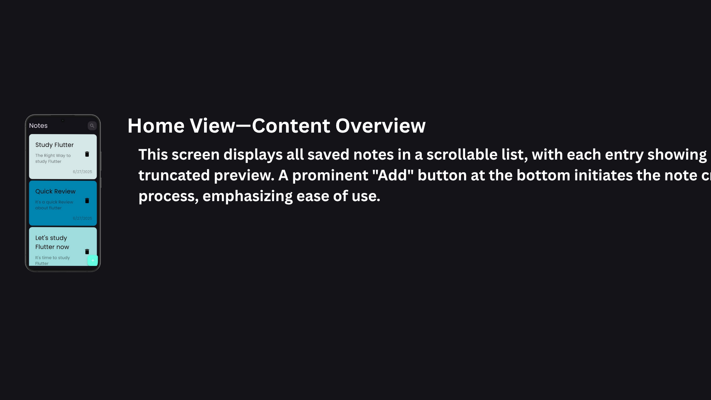
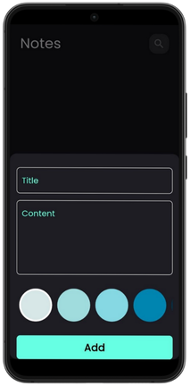
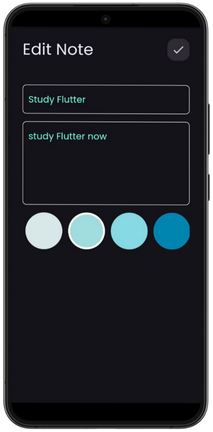

# Notely 📃
🗒️ A modern mobile app for organizing and managing your notes, featuring:
- 🧠 Quick note creation.  
- 🎨 Customizable colors.  
- 🔍 Easy edit options.

<p align="center">
  
</p>


## 🎨 Views

📋 **Home View:**
- 📒 View all saved notes in a clean list  
- ➕ Add new notes with a floating button  
- 🗑️ Swipe to delete instantly  

<p align="left">
  
</p>

##

📝 **Add Note View:**  
- 🧠 Create new notes with title & content  
- 🎨 Choose custom note color  
- 💾 Save notes locally with one tap  

<p align="left">
  
</p>

##

✏️ **Edit Note View:**  
- 🖋️ Edit existing notes quickly  
- 🎨 Update note color or content  
- 💾 Save changes easily  

<p align="left">
  
</p>


## 🛠️ Tech Stack

📱 **Frontend**
- Framework: Flutter  
- State Management: Bloc (Cubit)

🧠 **Local Storage**
- Hive  

## 🏗️ Architecture
- 🧩 MVC pattern
- 💽 Local storage

```
├── assets/
│   ├── fonts/
│   └── screen_shoots/
│
└── lib/
    ├── controller/                     # 🧠 Controller layer (contains all Cubits)
    │   ├── notes_cubit/                # Logic for managing existing notes
    │   │   ├── notes_cubit.dart
    │   │   └── notes_state.dart
    │   │
    │   └── add_notes_cubit/            # Logic for adding new notes
    │       ├── add_notes_cubit.dart
    │       └── add_notes_state.dart
    │
    ├── models/                         # 💾 Model layer (data structures / entities)
    │   └── note_model.dart
    │   └── note_model.g.dart
    │ 
    ├── views/                          # 🎨 View layer (UI screens)
    │   ├── notes_view.dart
    │   ├── edit_note_view.dart
    │   └── widgets/                    # Reusable UI components for views
    │
    ├── bloc_observer.dart              # Bloc observer for debugging Cubit transitions
    ├── constants.dart                  # App constants (colors, strings, etc.)
    └── main.dart                       # App entry point

```

**Key Points:**

- **controller/**: Acts as the Controller layer in the MVC pattern, containing Cubits (e.g., notes_cubit, add_notes_cubit) that manage app logic and state.
- **models/**: Represents the Model layer, defining data structures such as NoteModel used across the app.
- **views/**: Serves as the View layer, containing all UI screens and widgets that display data and interact with the user.
- **widgets/**: Holds reusable UI components shared between multiple views.
- **assets/**: Stores static resources such as fonts and screenshots.
- **main.dart**: The app’s main entry point.
- **bloc_observer.dart**: Observes Cubit/Bloc transitions for debugging.
- **constants.dart**: Centralized constants for theming and colors.

---

**This structure is scalable, modular, and easy to maintain as your app grows.**

