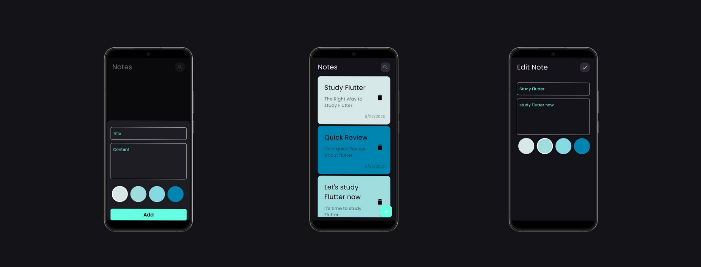
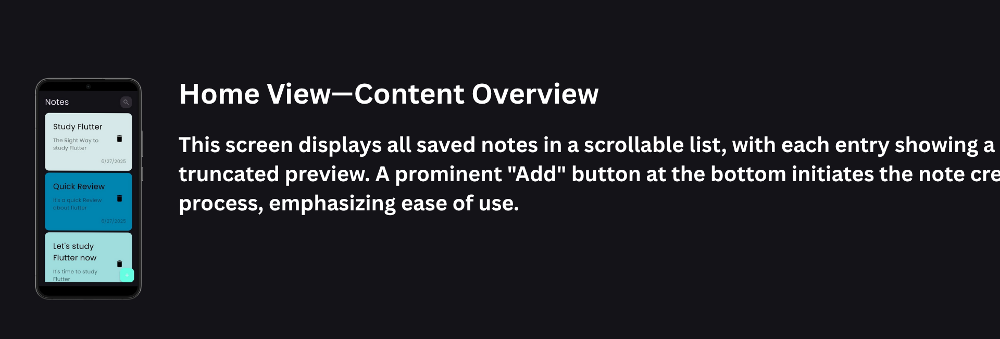
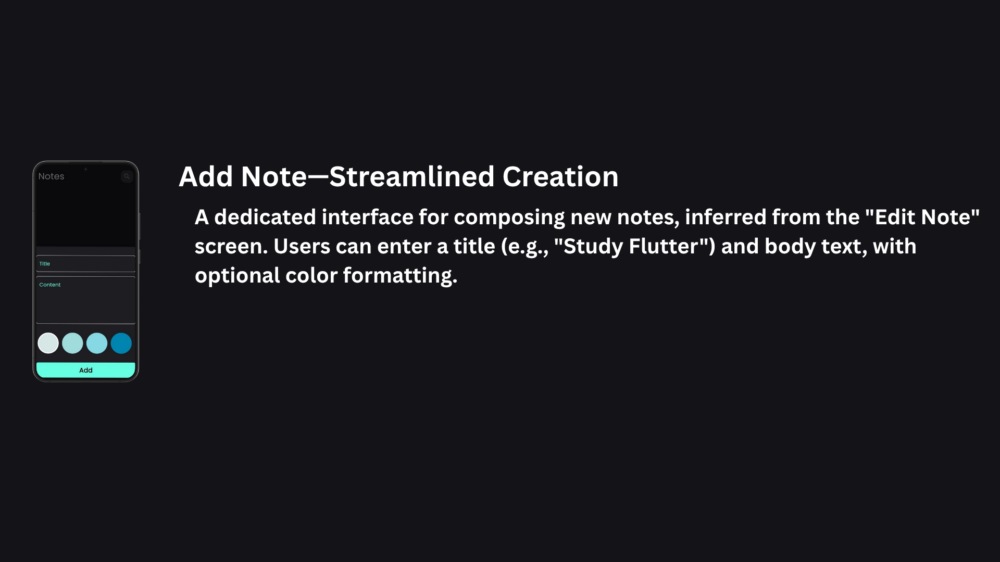
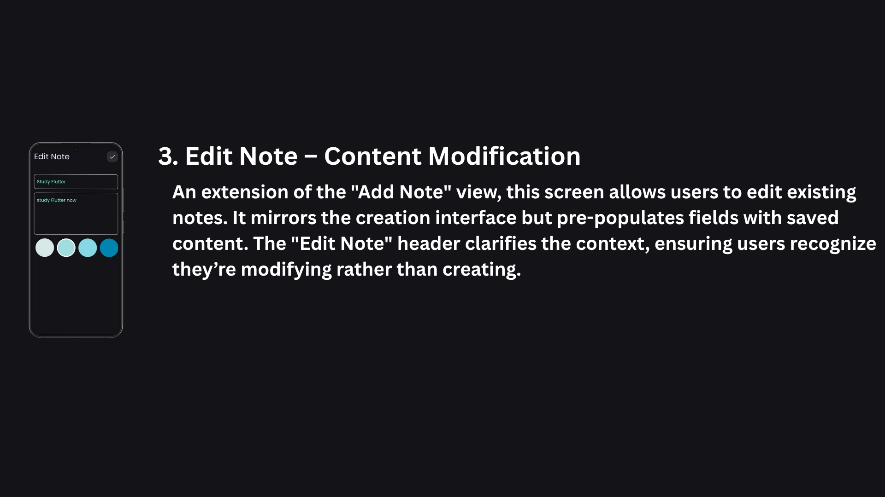

# Notely 📃
A modern mobile app for creating and managing notes, featuring:
- 🗒️ Simple and intuitive note creation  
- 🎨 Custom color selection for better organization  
- ✏️ Edit and delete notes with ease

  

  

## 🎨 Screens
- 📋 **Home:** Displays a list of all notes (title, content preview, date, delete icon)

  

  
- 🖊 New Note: Add a new note with title, content, and custom background color

  

- 💾 Edit Note: Modify an existing note's title, content, and color

  

  

## 🛠️ Tech Stack
📱 **Frontend**
- Framework: Flutter
- State Management: Bloc
  
🧠 **Local Storage**
- Hive

📦 **Dependencies**
`flutter_bloc` / `hive` / `hive_flutter` / `intl` / `modal_progress_hud_nsn`

 

